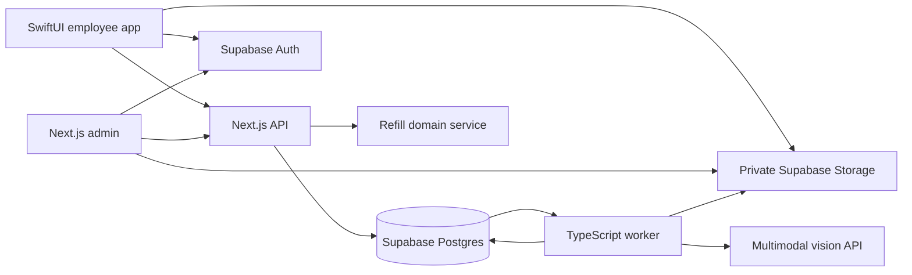

# Architecture Context

## Stack
| Layer | Technology | Role |
| --- | --- | --- |
| Employee | SwiftUI, Swift, AVFoundation, PhotosUI, URLSession, Supabase Swift | Native camera, login, review, history |
| Admin/API | Next.js App Router, TypeScript | Admin views and authenticated `/api/v1` endpoints |
| Web UI | Tailwind CSS, shadcn/ui | Accessible forms, tables, dialogs, POG rectangle editor |
| Identity | Supabase Auth | Email/password, invitations, reset, sessions |
| Database | Supabase Postgres, SQL migrations, generated TS types | Relational state, audit trail, RLS, transactional RPCs |
| Images | Supabase private Storage | POG references and scan photos |
| Analysis | Server-side multimodal vision API adapter | Counts, uncertainty, image-quality flags |
| Jobs | Postgres job table and dedicated TypeScript worker | Leases, retry, durable analysis |

Pin compatible stable dependency versions when scaffolding; this spec does not claim a tested lockfile. No ORM is required. Hosting is undecided; it must support the web app plus a persistent worker process. A request handler must not launch unawaited background work.

## System Boundaries
- `apps/ios/`: presentation, capture, session storage, and typed API client. No authoritative refill arithmetic.
- `apps/admin/app/api/v1/`: validation, verified identity, authorization, and service calls.
- `apps/admin/components/`: UI; interactive editor isolated as client components.
- `packages/domain/`: pure count validation, refill rules, immutable contracts.
- `packages/server/`: Supabase access, permission checks, transactions, storage, vision adapter.
- `workers/scan-worker/`: claims jobs, retrieves images, calls provider, persists output.
- `supabase/migrations/`: schema, constraints, indexes, RLS, narrowly granted RPCs.
- `context/`: specifications only. Proposed code paths are not existing implementations.

## Data Flow

Uploads use server-issued grants bound to exact paths; the server validates uploads before processing. Database stores object paths, never expiring signed URLs. The worker persists validated detections; the API derives recommendations through the same domain rules used during confirmation.

## Auth Model
Supabase Auth is the only identity system. Web uses cookie-based SSR sessions; iOS uses bearer access tokens with secure refresh-token storage. Both authenticate against the same project. Store membership is database authority, checked on every operation; self-editable user metadata is never a role source.

## Invariants
1. All tenant/store relationships are checked, including service-role operations that bypass RLS.
2. Published POG versions and their slot rows are immutable; scans pin one version at creation.
3. Every scan has one result row for every pinned slot, including unknowns.
4. AI returns observations only; server owns product assignment, thresholds, calculations, and status transitions.
5. Unknown quantity differs from an observed zero.
6. Worker retries cannot overwrite manual takeover, human review, or a newer attempt.
7. Confirmation stores a frozen result revision; historical scans never use the latest POG.
8. Completion does not prove current stock or update a perpetual inventory ledger.
